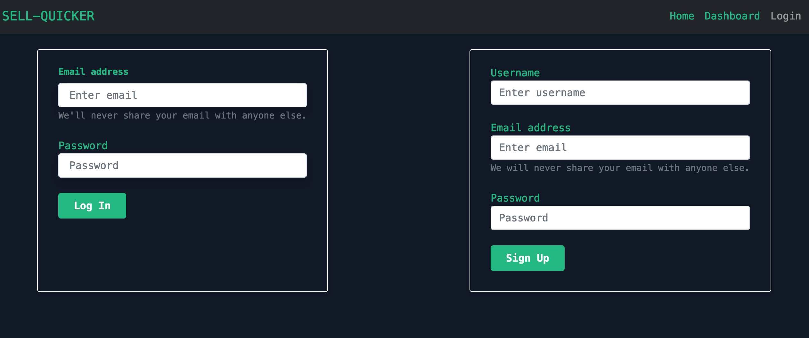
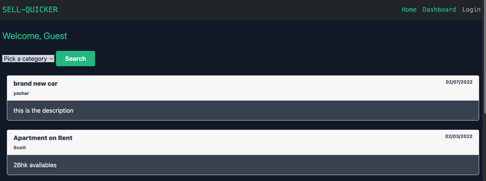

# Sell-Quicker

## Description
Post and Ad and sell within a day. Simple & elegant design, we believe less is more. Without all the extra chaff, you can focus making purchases and selling your products. All without annoying ads, clunky or intrusive interfaces. 
Our lean and wonderfully functional interface lets you focus on what’s most important. Selling quick. 
Let Sell-Quicker be your solution with our limitless users, you’re guaranteed to move products and generate next level income. 

## Table of Contents
* [Usage](#usage)
* [Credits](#credits)
* [License](#license)

## Usage
Go to the [website](https://sellquicker.herokuapp.com/) and create an account.

After creating an accounr proceed to the dashboard page and make your first post!

To view other ads and your own ads go to the home page!

## Credits

The lis of collaborators:

* [Karan Sodhi](https://github.com/KKkaran)
* [Avneet](https://github.com/avneetk3)
* [Roberto Gasparin](https://github.com/box-monkey)
* [Farjad Khan](https://github.com/farjaduk)
* [Yashar Sarabi](https://github.com/yasharjs)

## License

